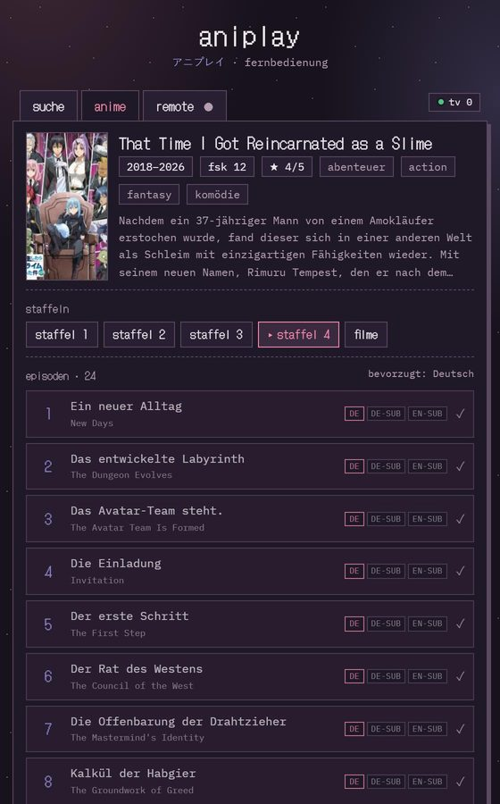

# aniplay

<!-- cozy:cards -->
<div align="center">

<a href="https://github.com/vxnsin/aniplay"><picture><source media="(prefers-color-scheme: dark)" srcset="https://raw.githubusercontent.com/vxnsin/aniplay/output/repo-dark.svg?v=93ad68adfa"></picture></a>

<a href="https://github.com/vxnsin/aniplay#loslegen"><picture><source media="(prefers-color-scheme: dark)" srcset="https://raw.githubusercontent.com/vxnsin/aniplay/output/nav-start-dark.svg?v=fbf725f61b"></picture></a><a href="https://github.com/vxnsin/aniwatch"><picture><source media="(prefers-color-scheme: dark)" srcset="https://raw.githubusercontent.com/vxnsin/aniplay/output/nav-aniwatch-dark.svg?v=420d706147"></picture></a>

<a href="https://github.com/vxnsin/aniplay/commits"><picture><source media="(prefers-color-scheme: dark)" srcset="https://raw.githubusercontent.com/vxnsin/aniplay/output/commits-dark.svg?v=1ebfa74cbb"></picture></a>

<a href="https://github.com/vxnsin/aniplay/graphs/contributors"><picture><source media="(prefers-color-scheme: dark)" srcset="https://raw.githubusercontent.com/vxnsin/aniplay/output/contributors-dark.svg?v=d20302f15e"></picture></a>

</div>
<!-- /cozy:cards -->

[](https://github.com/vxnsin/warden)

Anime im Wohnzimmer: Der Fernseher oder PC ist der Player, das Handy die Fernbedienung. Suchen, Folge antippen, auf dem großen Bildschirm schauen und vom Sofa aus pausieren, spulen und weiterschalten. Die Folgen kommen von aniworld.to.

<p align="center"></p>

## Was es kann

- **Ein Fernseher, eine Session:** Jeder TV bekommt einen eigenen Code. Der QR-Code auf dem TV verbindet das Handy mit genau diesem Fernseher. Wiedergabe, Verlauf, Weiterschauen und Einstellungen sind pro TV getrennt. Zwei Leute im selben WLAN schauen so gleichzeitig verschiedene Sachen, ohne sich in die Quere zu kommen.
- **Suche** direkt auf dem Handy, oder einen aniworld-Link einfügen.
- **Staffeln, Filme und Folgen** mit deutschem und englischem Titel und den verfügbaren Sprachen.
- **Sprache und Hoster wechseln**, die Position bleibt erhalten.
- **Weiterschauen:** Jede Folge startet dort, wo du aufgehört hast, pro Fernseher. Fertig geschaute bekommen einen Haken. Verlauf und Fortschritt liegen in SQLite.
- **AniWorld-Profil**, optional und pro Fernseher: Namen eintragen, dann zeigt die Fernbedienung zuletzt geschaut, Watchlist und Abos. Gesehene Folgen werden markiert.
- **Autoplay:** Die nächste Folge startet von selbst, auch über Staffelgrenzen. Abschaltbar.
- **Hoster-Fallback:** Spielt eine Quelle auf dem TV nicht, nimmt aniplay automatisch die nächste.
- Mehrere Handys können denselben TV steuern. Fernseher lassen sich benennen, etwa „wohnzimmer“.
- Die laufende Folge überlebt einen Server-Neustart, jeder TV spielt einfach weiter.
- Heller und dunkler Modus, folgt dem System.

## Loslegen

### Auf dem Raspberry Pi

Am einfachsten läuft aniplay dauerhaft auf einem Raspberry Pi oder einem anderen Debian-Rechner im Heimnetz:

```bash
curl -fsSL https://raw.githubusercontent.com/vxnsin/aniplay/main/scripts/setup-pi.sh | bash
```

Das Script fragt nach Ordner, Port, Dienstname und der Adresse für die QR-Codes und schlägt für alles einen Wert vor, Enter übernimmt. Danach installiert es Node, falls es fehlt, lädt aniplay herunter, legt die Datenbank nach `/var/lib/aniplay` und richtet einen Dienst ein, der beim Booten startet. Es braucht keine Domain, und nichts wird ins Internet geöffnet.

Update: das Script einfach nochmal starten. Ohne Fragen: `bash ~/aniplay/scripts/setup-pi.sh --yes`.

Tipp: Gib dem Pi im Router eine feste IP, dann bleiben die QR-Codes gültig. Oder trag bei der Frage nach der Adresse `http://<hostname>.local:3000` ein.

### Auf dem eigenen Rechner

Voraussetzung ist Node 22.13 oder neuer.

```bash
git clone https://github.com/vxnsin/aniplay.git
cd aniplay
npm install
npm start
```

Dann im Browser:

| gerät | adresse |
|---|---|
| TV oder PC | `http://<ip-des-rechners>:3000/watcher` |
| Handy | den QR-Code auf dem TV scannen, oder `http://<ip-des-rechners>:3000/controller` öffnen und den Code vom TV eingeben |

Alle Geräte müssen im selben WLAN sein. Den Port ändert `PORT=4000 npm start`. Beim Start gibt der Server die Adressen mit der richtigen IP aus.

### Mehrere Fernseher

Jeder Browser, der `/watcher` öffnet, ist ein eigener Fernseher mit eigenem vierstelligen Code und merkt sich diesen Code. Das Handy, das den QR-Code eines TVs scannt, steuert nur diesen TV und sieht nur dessen Verlauf. Über „anderen tv wählen“ in der Fernbedienung kommst du zu einem anderen Fernseher. Einen TV gezielt spiegeln geht mit `/watcher?s=CODE`.

## Bedienung

Auf dem Handy: Play/Pause, ±10, 30, 60 und 85 Sekunden, Seek-Leiste, Lautstärke, stumm, Vollbild, vorige und nächste Folge, „von vorne“, TV synchronisieren und Stop.

Tastatur am TV: `Space` Pause, `←` `→` ±10 Sekunden (mit `Shift` ±60), `↑` `↓` Lautstärke, `f` Vollbild, `m` stumm, `i` Info, `Esc` Stop.

## Einstellungen

| variable | standard | |
|---|---|---|
| `PORT` | `3000` | Port des Servers |
| `DATA_DIR` | `./data` | Ordner der Datenbank `aniplay.sqlite` |
| `PUBLIC_URL` | LAN-IP automatisch | Adresse in den QR-Codes, z. B. `http://pi.local:3000` |
| `WARDEN_URL` | `http://127.0.0.1:7010` | Adresse des warden, siehe unten |
| `WARDEN_NAME` | `aniplay` | Name, unter dem sich aniplay beim warden anmeldet |
| `WARDEN_TOKEN` | leer | Token, falls der warden eines verlangt |
| `WARDEN` | leer | `0` fragt den warden gar nicht erst |

Auf dem Pi stehen sie in `/etc/aniplay.env`. Die Datenbank lässt sich einfach sichern, sie ist eine einzige Datei.

### Port vom warden

Läuft auf dem Rechner ein [warden](https://github.com/vxnsin/warden), fragt aniplay ihn beim Start nach seinem Port, statt einfach `PORT` zu nehmen. `PORT` ist dann der Wunsch: Ist er frei, bleibt es dabei, sonst vergibt der warden einen anderen, und aniplay sagt beim Start, welchen. Derselbe Name bekommt bei jedem Start denselben Port, `warden ls` zeigt, wer ihn hält, und beim Beenden wird er zurückgegeben. Ohne warden ändert sich nichts. `warden run -- npm start` geht genauso, dann hält der warden den Port für den Prozess.

Zum Entwickeln startet `npm run dev` den Server mit nodemon neu, sobald sich Code ändert.

## Hoster

| hoster | modus |
|---|---|
| VOE | HLS, MP4 als Ersatz |
| Vidmoly | HLS |
| Filemoon | HLS, auf manchen Domains nur als Iframe |
| Vidoza, Streamtape | MP4 |
| Doodstream | nur Iframe, dann steuerst du direkt am TV |

Alle Streams laufen über `/api/proxy`, damit Referer und User-Agent der Hoster stimmen.

Einen neuen Hoster einbauen: eine Datei in `lib/loaders/` anlegen, sie wird automatisch geladen.

```js
const name = 'meinhoster';
const aliases = ['meinhoster']; // so wie aniworld den hoster nennt
function matches(url) { return /meinhoster\.com/i.test(url); }
async function resolve(embedUrl, ctx) {
  // seite laden, stream-url herausziehen …
  return { streamType: 'hls', url: 'https://…/master.m3u8', embedUrl, referer: 'https://meinhoster.com/', hosterName: 'MeinHoster' };
}
module.exports = { name, aliases, matches, resolve };
```

`streamType` ist `hls`, `mp4` oder `embed`, letzteres als Iframe-Ersatz.

## Test

```bash
npm test
npm test -- frieren-beyond-journeys-end
```

Der Smoke-Test fragt aniworld.to live ab: Suche, Serie, Staffel, Folge und jeden Hoster einmal.

## Aufbau

```
server.js              Express und WebSocket, API, Stream-Proxy, Kopplung
lib/session.js         eine Session pro Fernseher: Wiedergabe, Sockets, Autoplay, Fallback
lib/http.js            fetch mit User-Agent und Timeout
lib/aniworld.js        Suche, Serie, Staffel, Folge, Profil
lib/stream-resolve.js  Hoster-Reihenfolge, Weiterleitung zum Loader
lib/store.js           SQLite: Fernseher, Einstellungen, Verlauf, Fortschritt – alles pro TV
lib/warden.js          Port vom warden, falls einer läuft
scripts/setup-pi.sh    Einrichtung auf einem Pi im Heimnetz
lib/loaders/           ein Loader pro Hoster
public/                watcher.html (TV), controller.html (Handy), index.html
```

## Hinweise

- Die Inhalte kommen von aniworld.to und den jeweiligen Hostern, aniplay speichert keine Videos. Ob das Ansehen bei dir erlaubt ist, liegt in deiner Verantwortung.
- Zusammen im Discord-Sprachkanal schauen: [aniwatch](https://github.com/vxnsin/aniwatch).

## Lizenz

MIT
